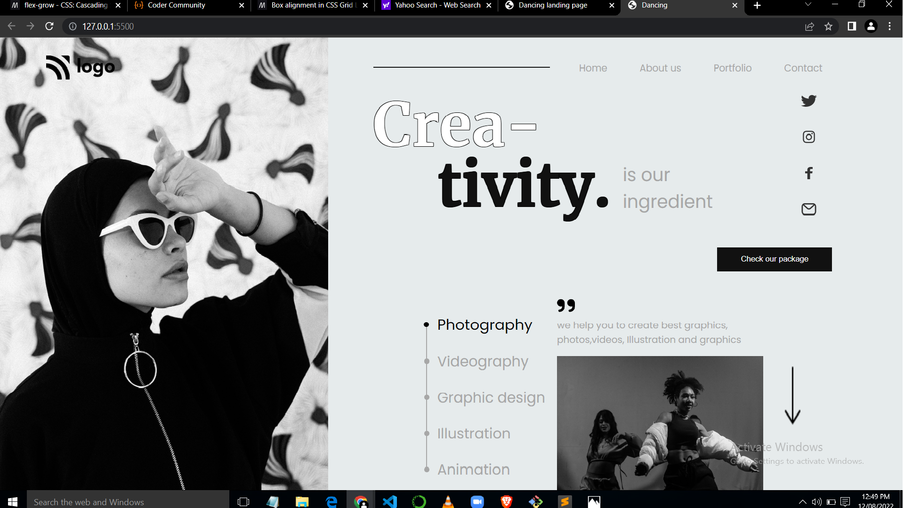

# Project 14 of Full Stack Web Dev course.

 I design this web page using Html and Css. it is a bit difficult for me but eventually i have completed the project. In this project i learned a lot and became more comfortable with html Css and flexbox.

 

 # Skills.
 - HTML
 - Css

# Things that i learned
- Disgning Navigation Menu
- Positioning 
- linking images
- Css
- font styles

# project comlpeted in
- ## 7hr